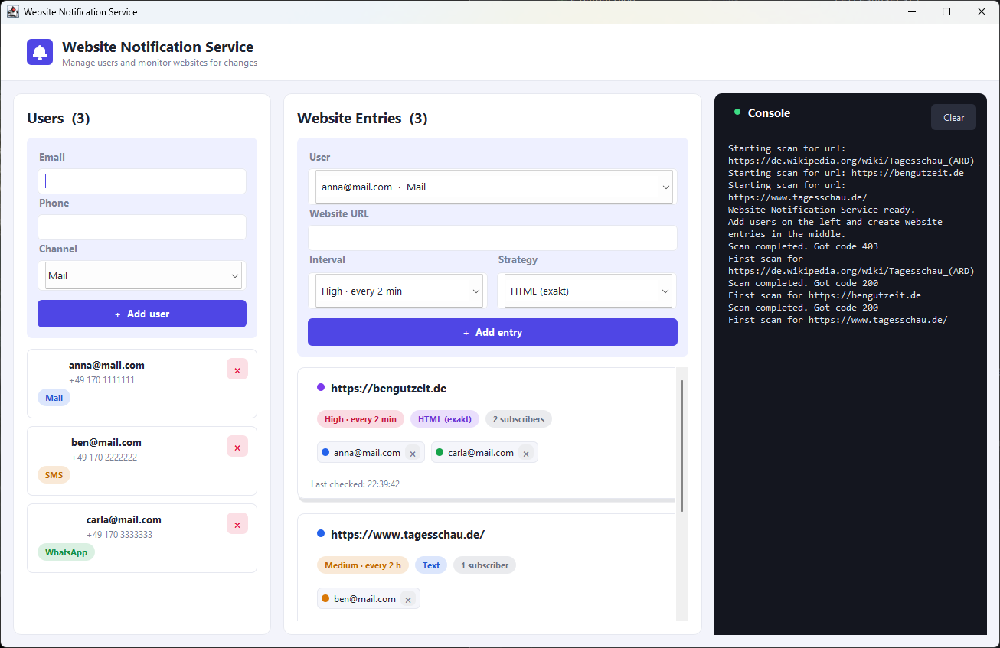
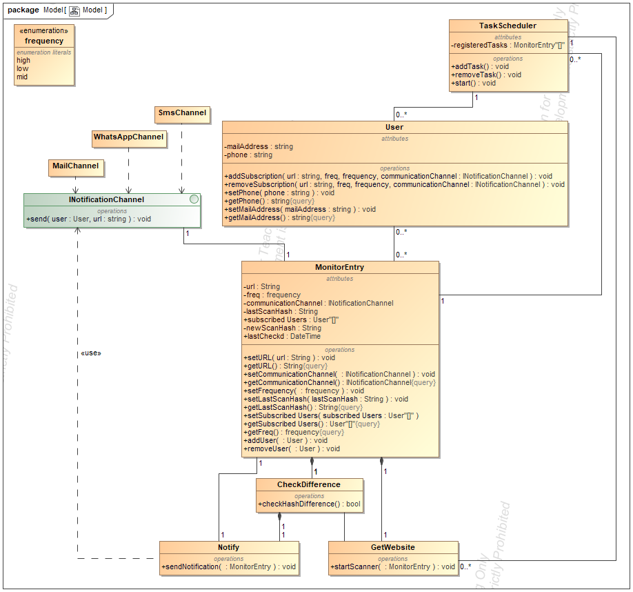

# Website Notification Service

A small Java service that periodically scans websites for content changes and
notifies subscribed users through pluggable channels (Mail, SMS, WhatsApp).

Change detection is done by comparing the page body between consecutive scans
using a pluggable strategy (full HTML, visible text only, or response size). As
soon as a difference is detected, the monitor entry notifies its subscribers via
the **observer pattern** — each user is updated and delivers the message through
the channel they chose.

---

## Graphical interface (GUI)

A desktop GUI (Java Swing) bundles user management, entry creation and the live
console output into a single window.



> **This graphical interface (`src/Gui.java`) was designed and implemented by
> Claude (Anthropic's Claude Code).** It is a self-contained, hand-written Swing
> UI and is **not** part of the original coursework backend — the only backend
> change it required was adding a read-only `TaskScheduler.getRegisteredTasks()`
> snapshot.

- **Users** (left) — add or remove users and choose their notification channel
  (Mail / SMS / WhatsApp).
- **Website Entries** (middle) — create a monitored entry from a user, a URL, a
  scan interval and a change-detection strategy. Each entry is its own rounded
  card listing its subscribers, the last-checked time and a **live countdown to
  the next scan**.
- **Console** (right) — mirrors `System.out` / `System.err` in real time
  (errors in red), so the scheduler's scan log is visible inside the app.

The UI drives the existing backend only through `TaskScheduler`
(`addSubscription` / `removeSubscription` / `getRegisteredTasks`) and keeps no
duplicate business logic. See [Run the GUI](#run-the-gui) below.

---

## Features

- **Desktop GUI (built by Claude)** — a Swing front-end to manage users, create
  monitored entries and watch the live console; see
  [Graphical interface](#graphical-interface-gui).
- **Multiple notification channels** — Mail, SMS and WhatsApp out of the box,
  unified behind the `INotificationChannel` interface so new channels can be
  added with a single class.
- **Configurable scan frequency** per subscription:
  - `high` — every minute
  - `mid`  — every hour
  - `low`  — every 5 hours
- **Pluggable change detection** via the `IContentType` strategy interface —
  compare the full HTML (`IdenticalHtml`), visible text (`IdenticalText`), or
  response size (`IdenticalSize`).
- **Observer-based notifications**: a `MonitorEntry` notifies its subscribed
  `User`s on change, and each user delivers via their own channel.
- **Thread-safe singleton scheduler** that auto-starts on the first registered
  task and polls all monitor entries on a dedicated background thread. Each due
  scan is dispatched to its own worker thread, with a per-entry guard so the same
  entry is never scanned by two threads at once.
- **Per-user subscriptions**: a user can subscribe to many URLs, and many users
  can share the same URL/frequency pair.

---

## Architecture



| Class                  | Responsibility                                                |
| ---------------------- | ------------------------------------------------------------- |
| `Main`                 | Entry point — wires up sample subscriptions.                  |
| `Gui`                  | **Swing desktop UI — built by Claude.** User management, entry creation, live console; drives the backend via `TaskScheduler`. Has its own `main`. |
| `User`                 | Holds contact data and channel; observer that delivers on `update()`. |
| `MonitorEntry`         | One watched URL: settings, scan bodies, subscriber list, `notifyObservers()`. |
| `Frequency`            | Scan-interval tiers (`low`, `mid`, `high`).                   |
| `TaskScheduler`        | Thread-safe singleton polling loop; owns all monitor entries and dispatches each due scan to a worker thread. Exposes a read-only `getRegisteredTasks()` snapshot for the GUI. |
| `GetWebsite`           | Performs the HTTP GET and stores the new response body.       |
| `CheckDifference`      | Delegates to the entry's `IContentType`; returns whether the page changed. |
| `IContentType`         | Strategy contract for comparing two scans (`IdenticalHtml`/`Text`/`Size`). |
| `IdenticalHtml`        | Detection strategy: byte-for-byte comparison of the full raw HTML. |
| `IdenticalText`        | Detection strategy: compares visible text only (HTML stripped via Jsoup). |
| `IdenticalSize`        | Detection strategy: flags a change only when the response length differs. |
| `INotificationChannel` | Common contract for delivery channels.                        |
| `MailChannel`          | Sends notification via e-mail (stub).                         |
| `SmsChannel`           | Sends notification via SMS (stub).                            |
| `WhatsAppChannel`      | Sends notification via WhatsApp (stub).                       |

> The three channel implementations currently print to `stdout` instead of
> talking to a real provider — they are designed to be swapped for real
> integrations without touching the rest of the codebase.

---

## Requirements

- **JDK 21+** — the code uses Java 21 features such as instance `main` methods
  (`void main(String[] args)` in `Main.java`) and `java.net.http.HttpClient`.
  (Developed and tested on JDK 26.)
- **jsoup** — bundled in `lib/jsoup-1.22.2.jar`; required on the classpath by the
  `IdenticalText` strategy when compiling and running.
- **Docker (optional)** — to run the headless monitor in a container without a
  local JDK; see [Run with Docker](#run-with-docker).
- No external build tool is required; the project ships as a plain IntelliJ
  module (`.iml`).

---

## Getting started

### Run from IntelliJ

1. Open the project folder in IntelliJ IDEA.
2. **GUI:** right-click `src/Gui.java` and choose **Run 'Gui'**.
3. **Headless demo:** right-click `src/Main.java` and choose **Run 'Main'**.

### Run the GUI

`Gui` has its own `main`, separate from the headless `Main` demo. jsoup must be
on the classpath (Windows uses `;` as the separator, Linux/macOS use `:`):

```bash
# Compile (jsoup is required by the IdenticalText strategy)
javac -encoding UTF-8 -d out -cp lib/jsoup-1.22.2.jar src/*.java

# Run the GUI — Windows
java -cp "out;lib/jsoup-1.22.2.jar" Gui
# Run the GUI — Linux/macOS
java -cp "out:lib/jsoup-1.22.2.jar" Gui
```

### Run the headless demo

```bash
# Windows
java -cp "out;lib/jsoup-1.22.2.jar" Main
# Linux/macOS
java -cp "out:lib/jsoup-1.22.2.jar" Main
```

### Run with Docker

The desktop GUI needs a display and is not container-friendly; the container
runs the headless `Main`, which takes the **URL to monitor as its first
argument**. A multi-stage `Dockerfile` is included in the project root — it
compiles the sources (jsoup on the classpath) and runs `Main` in a slim JRE
image.

Build the image, then run it with the URL as an argument:

```bash
docker build -t website-monitor .
docker run --rm website-monitor https://bengutzeit.de
```

Because of the exec-form `ENTRYPOINT`, anything appended to `docker run` is
forwarded to `Main` as `args[0]`. Run without an argument to fall back to the
built-in demo subscriptions. The channel stubs print to `stdout`, so scan and
change messages show up in the container output (`docker logs`).

### Sample run

The default `Main` registers a few high-frequency subscriptions, each user
carrying their own channel:

```java
User test1 = new User("test@mail.com",  "+123456789",  new MailChannel());
TaskScheduler scheduler = TaskScheduler.getInstance();
scheduler.addSubscription("https://bengutzeit.de", Frequency.high, test1, new IdenticalHtml());
```

Expected console output (first scan establishes the baseline, later scans
report whether the page changed):

```
Starting scan for url: https://bengutzeit.de
Scan completed. Got code 200
First scan for https://bengutzeit.de — baseline stored, no notification.
...
Website https://bengutzeit.de has not changed!
```

When a change is detected, the chosen channel prints something like:

```
Empfänger: test@mail.com
Änderung an der Website: https://bengutzeit.de/
Benachrichtigung über Mail channel
```

---

## Tests

> **The unit tests (`test/EquivalenceClassTest.java`) were designed and
> implemented by Claude (Anthropic's Claude Code).**

Equivalence-class tests for the change-detection / notification pipeline
(Exercise 6), written with **JUnit 5 (Jupiter)**. The six cases mirror the
equivalence classes EC1–EC6: a valid URL/frequency with each valid channel
(WhatsApp / SMS / Mail), plus the invalid partitions (null channel, null
frequency, malformed URL).

Because the production classes live in the **default (unnamed) package**, the
test class does too — types in the unnamed package cannot be imported from a
named package. The tests use a small `SpyChannel` test double (wrapping the real
channel) to assert delivery deterministically, without real HTTP, threads or the
singleton scheduler.

Notable finding: **EC4** documents that a `null` channel currently raises a
`NullPointerException` in `User.update()` once a change is detected — the code
has no null-channel guard.

### Run the tests

The JUnit 5 jars are bundled in `lib/`. Easiest is from IntelliJ (right-click
`test/EquivalenceClassTest.java` → **Run**). From the CLI you additionally need
the JUnit Platform Console launcher (`junit-platform-console-standalone`, *not*
bundled):

```bash
# Compile sources + tests
javac -encoding UTF-8 -d out -cp "lib/*" src/*.java test/*.java

# Run (Windows ';' separator; Linux/macOS use ':')
java -jar junit-platform-console-standalone.jar execute \
  -cp "out;lib/jsoup-1.22.2.jar" --select-class=EquivalenceClassTest
```

---

## Adding a new notification channel

Implement `INotificationChannel` and pass an instance into the `User`
constructor, then subscribe that user through the scheduler:

```java
public class SlackChannel implements INotificationChannel {
    @Override
    public void send(User user, String url) {
        // call your Slack API here
    }
}

User user = new User("me@example.com", "+49123", new SlackChannel());
TaskScheduler.getInstance().addSubscription("https://example.com", Frequency.mid, user, new IdenticalText());
```

---

## Project layout

```
WebsiteNotificationService/
├── README.md
├── Dockerfile                      # headless monitor container (build + run)
├── Model.png                       # architecture diagram
├── gui.png                         # GUI screenshot (UI built by Claude)
├── WebsiteNotificationService.iml
├── lib/
│   ├── jsoup-1.22.2.jar
│   └── junit-*-6.0.0.jar           # JUnit 5 (Jupiter) test dependencies
├── out/                            # compiled classes (generated)
├── test/
│   └── EquivalenceClassTest.java   # EC1–EC6 unit tests (built by Claude)
└── src/
    ├── Gui.java                    # Swing desktop UI (built by Claude)
    ├── Main.java
    ├── User.java
    ├── MonitorEntry.java
    ├── Frequency.java
    ├── TaskScheduler.java
    ├── GetWebsite.java
    ├── CheckDifference.java
    ├── IContentType.java
    ├── IdenticalHtml.java
    ├── IdenticalText.java
    ├── IdenticalSize.java
    ├── INotificationChannel.java
    ├── MailChannel.java
    ├── SmsChannel.java
    └── WhatsAppChannel.java
```

---

## Known limitations / roadmap

- Channel classes are stub implementations (console output only).
- The polling loop runs on one background thread and spawns a short-lived raw
  thread per due scan; a pooled `ScheduledExecutorService` would scale better and
  avoid unbounded thread creation.
- Subscriptions are kept in memory only; no persistence layer yet.
- Only successful (`HTTP 200`) responses are compared; redirects and error pages
  are currently ignored.
- There is no built-in shutdown hook; the loop is stopped by setting
  `scheduler.stop = true`.

---

## Changelog

### [Unreleased] — 2026-06-29 (Tests)

#### Added
- **Equivalence-class unit tests (`test/EquivalenceClassTest.java`), designed and
  implemented by Claude (Anthropic's Claude Code).** Six JUnit 5 cases covering
  EC1–EC6 of Exercise 6 (valid URL/frequency with each valid channel; plus null
  channel, null frequency and malformed URL). A `SpyChannel` test double makes
  notification delivery deterministic without HTTP, threads or the scheduler.
- `test/` test source root and the JUnit 5 (Jupiter 6.0.0) dependencies in `lib/`.

#### Notes
- The tests live in the default (unnamed) package because the production classes
  do — unnamed-package types cannot be imported from a named package.
- EC4 documents a missing null-channel guard: a `null` channel currently throws a
  `NullPointerException` in `User.update()` when a change is detected.

### [Unreleased] — 2026-06-23 (Docker)

#### Added
- **Docker support for the headless monitor** — a multi-stage `Dockerfile` that
  compiles the sources (jsoup on the classpath) and runs `Main` in a slim JRE
  image. The URL to monitor is passed as a container argument
  (`docker run website-monitor <url>`) and forwarded to `Main` as `args[0]` via
  the exec-form `ENTRYPOINT`.

#### Changed
- `Main` reads the URL to monitor from its first argument
  (`void main(String[] args)`, using `args[0]`) and falls back to the built-in
  demo subscriptions when no argument is given.

### [Unreleased] — 2026-06-10 (GUI)

#### Added
- **Graphical user interface (`src/Gui.java`), designed and implemented by Claude
  (Anthropic's Claude Code).** A hand-written Swing desktop app: user management,
  website-entry creation, an overview of entries as rounded cards (each with a
  live "next scan" countdown and a "last checked" time), and a console panel that
  mirrors `System.out` / `System.err` in real time. White theme with colourful
  accents; English UI.
- `TaskScheduler.getRegisteredTasks()` — a thread-safe snapshot (`Arrays.copyOf`
  under the existing lock) of the registered tasks, so the GUI renders the live
  entry list without keeping a second, drift-prone copy.

#### Notes
- The GUI is launched via its own `Gui` class (`public static void main`),
  independent of `Main`; no other backend class was modified.

### [Unreleased] — 2026-06-09

#### Changed
- Scans now run concurrently: the polling loop dispatches each due entry to its
  own worker thread instead of scanning inline, so a slow fetch no longer stalls
  the loop.

#### Added
- Per-entry `AtomicBoolean` guard (`MonitorEntry.scanning`) so the same entry is
  never scanned by two threads at once.
- `volatile` on `lastChecked` and `subscribedUsers`, plus copy-on-write for the
  subscriber list, so the loop and scan workers share state safely.

#### Fixed
- Thread storm / duplicate concurrent scans of the same entry: the eligibility
  clock is reset before the worker starts, and the guard blocks any overlap.
- Data race on the stored scan bodies (`lastScan` / `newScan`) when scans overlapped.
- Subscriber-list races: a possible `NullPointerException` on `addUser` and an
  inconsistent snapshot on `removeUser`, both from mutating the live array.
- A per-scan `IOException` now only ends its own worker (logged) instead of
  killing the whole polling loop; `InterruptedException` restores the interrupt flag.

### [Unreleased] — 2026-05-30

#### Added
- Pluggable change-detection strategies behind the `IContentType` interface:
  `IdenticalHtml` (full HTML), `IdenticalText` (visible text via Jsoup) and
  `IdenticalSize` (response length). Each subscription picks its own strategy.

#### Changed
- `addSubscription` / `removeSubscription` now take an `IContentType` argument,
  and a task is matched by URL **and** frequency **and** content type.
- Doc comments and README updated to reflect the strategy-based detection.

#### Removed
- SHA-256 hashing of the response body — replaced by the `IContentType`
  strategies that compare the stored bodies directly.

### [Unreleased] — 2026-05-23

#### Added
- Observer-based notification flow: `MonitorEntry.notifyObservers()` →
  `User.update()` → the user's `INotificationChannel`.
- Background execution: the scheduler's polling loop now runs on its own thread,
  so `main` keeps control after registering subscriptions.
- Doc comments across the scheduler, observer and change-detection classes.

#### Changed
- `TaskScheduler.getInstance()` is now thread-safe (`synchronized`); shared state
  is guarded by a dedicated lock object and `volatile` flags.
- Each `User` now carries its own notification channel instead of attaching it
  to the `MonitorEntry`.

#### Fixed
- `ArrayIndexOutOfBoundsException` when subscribing the first task, caused by
  Java's left-to-right evaluation of `registeredTasks[addTask(...)]`.
- Off-by-one out-of-bounds error while shifting arrays in `removeTask` and
  `MonitorEntry.removeUser`.
- `removeSubscription` now removes the last subscriber correctly.
- Double / dead notification path: notifications are no longer sent twice.

#### Removed
- The `Notify` class — superseded by the observer pattern.

---

## License

Coursework project for SWED — no license specified.
